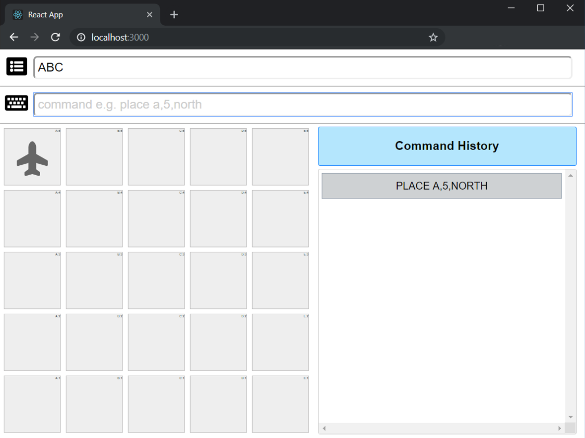

# Fake Drone Simulator
Fake Drone is an application to simulate drone commands and display drone within 5x5 grid on web application
This repository consists of 2 modules which is:  



## Web
 - To display & command drone
 - Drone Commands:
    - `PLACE X,Y,FACE` -- a command to place drone where: 
      - `X` in Character - [A,B,C,D,E]
      - `Y` in Number - [0-4]
      - `FACE` in String - [north, south, east,west]
    - `MOVE` -- move drone towards `FACE` but only inbound
    - `LEFT` -- facing drone to left-hand-side
    - `RIGHT` -- facing drone to right-hand-side


## Server
 - To record drone position and command history

# Prerequisite 
 - Docker

# Run Web Application
 - run `setup.sh`

 ```
 ./setup.sh
 ```
 
 - start all servers by following command

 ```
 docker-compose up
 ```

 - system can access via http://localhost:3000
 - influxDB admin was included and can be access via http://localhost:8888


# Technology Stack
 - Nodejs
 - React
 - InfluxDB
